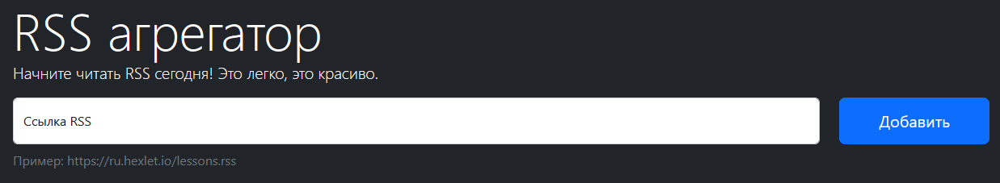

# RSS Aggregator

[Check it out on Vercel](https://frontend-project-11-kappa-self.vercel.app/)

[](https://github.com/worldspawn-web/frontend-project-11/actions/workflows/hexlet-check.yml)
[](https://codeclimate.com/github/worldspawn-web/frontend-project-11/maintainability)



## What is this project about?

RSS Aggregator - is a simple feed generator. It collects RSS feeds and watch for a new posts every 5 seconds (adjustable).

### Used Stack:

- JavaScript (ESLint - Airbnb + Prettier)
- Lodash
- Bootstrap
- Webpack
- Yup
- Axios
- All-Origins (proxy)
- on-change
- i18next

### To run locally on your machine:

```
# You need to have Node.js & NPM installed!
make install
make build
make develop
```
